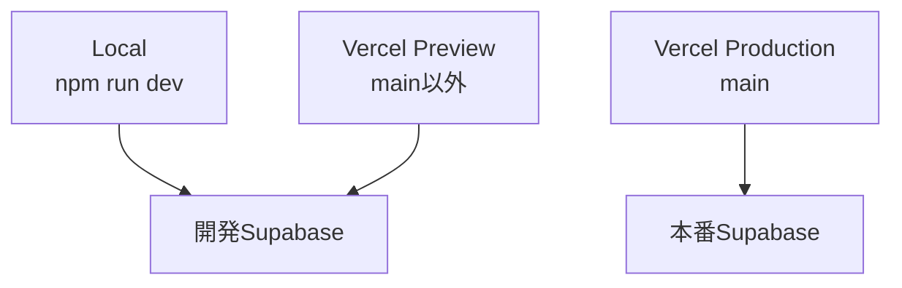

# Task Tool

NPO業務向けのタスク管理ツールです。
ログイン、所属・権限管理、タスク作成、担当者設定、期限通知、LINE通知などを提供します。

## 1. 最初に確認すること

久しぶりに改修する場合は、以下の順で確認してください。

1. このREADMEの「環境構成」を確認
2. `main`を最新化
3. `.env.local`が開発Supabaseを向いていることを確認
4. `npm run dev`でローカル動作確認
5. 作業ブランチを作成
6. push後、Vercel Previewで確認
7. Pull Request経由で`main`へマージ
8. Production Deploymentを確認

```bash
git switch main
git pull --ff-only origin main
git status --short
npm install
npm run dev
```

本番へ直接変更を加えないでください。

---

## 2. システム概要

### 主な機能

- ユーザー登録・ログイン
- パスワード再設定
- 支部・部署・メンバー管理
- ロールによる権限制御
- タスク作成・更新・担当者設定
- タスクのカレンダー表示
- 期限・予定時刻による通知ジョブ作成
- LINEアカウント連携
- LINE通知送信

### 技術構成

| 項目 | 技術 |
|---|---|
| フロントエンド | Next.js `<version>` |
| 言語 | TypeScript |
| ホスティング | Vercel |
| DB・認証 | Supabase |
| Edge Functions | Supabase Edge Functions |
| Bot対策 | Cloudflare Turnstile |
| 外部通知 | LINE Messaging API |
| リポジトリ | GitHub |

---

## 3. 環境構成



| 環境 | 起動・デプロイ元 | Supabase | 用途 |
|---|---|---|---|
| Local | `.env.local`＋`npm run dev` | 開発 | 日常開発 |
| Preview | Vercelの非`main`ブランチ | 開発 | PR前検証 |
| Production | Vercelの`main`ブランチ | 本番 | 利用者向け本番 |

### 重要な原則

- LocalとPreviewは開発Supabaseを使用する
- Productionだけが本番Supabaseを使用する
- Previewから本番データへ接続しない
- 開発Cronは通常停止する
- 本番変更はPull Request経由で行う
- Secret値をREADME、ソースコード、Git履歴へ入れない

---

## 4. リソース一覧

### GitHub

| 項目 | 値 |
|---|---|
| Repository | `matsumoto14133/task-tool` |
| Production Branch | `main` |

### Vercel

| 項目 | 値 |
|---|---|
| 使用Project | `task-tool-prod` |
| Production Domain | `https://www.tasktool-dot-jp-hiroshima.jp` |
| Vercel Domain | `task-tool-prod.vercel.app` |
| Preview | 非`main`ブランチから自動作成 |

### Supabase

| 環境 | Project名 | Project Ref | 用途 |
|---|---|---|---|
| 開発 | `TaskTool` | `astzazujnpmdnzpbimcb` | Local・Preview |
| 本番 | `TaskTool-prod` | `dgnecjszhaiuqhvvblsq` | Production |

---

## 5. 主要ディレクトリ

```text
.
├── app/
│   ├── admin/                       # メンバー管理、部署管理、名前変更
│   ├── auth/                        # メール系？
│   ├── calendar/                    # カレンダー
│   ├── dashboard/                   # ダッシュボード
│   ├── forgot-password/             # 再設定メール送信
│   ├── login/                       # ログイン
│   ├── projects/                    # プロジェクト一覧
│   ├── reset-password/              # パスワード再設定
│   ├── settings/                    # 通知設定
│   ├── signup/                      # ユーザー登録
│   └── tasks/                       # 支部のタスク一覧
├── src/
│   ├── components/                  # コンポーネント
│   ├── hooks/                       # スマホ対応
│   └── lib/
│       ├── admin/                   # 管理権限・型定義
│       ├── env/                     # URLなどの環境判定
│       └── supabase/                # Browser・Server・Admin Client
├── supabase/
│   ├── config.toml                  # Edge Functionごとの設定
│   ├── migrations/                  # DB Migration
│   └── functions/
│       ├── _shared/                 # Edge Functions共通処理
│       ├── line-webhook/
│       ├── run-notifications/
│       ├── create-notification-jobs/
│       ├── create-daily-summary-jobs/
│       ├── create-timed-notification-jobs/
│       └── send-notifications/
├── public/                           # 静的ファイル
├── proxy.ts                          # 認証・ルーティング制御
├── .env.local                        # ローカル環境変数・Git管理外
└── README.md
```

現在の構成を確認する場合：

```bash
find app src supabase \
  -maxdepth 3 \
  -type f \
  | sort
```

---

## 6. ローカル開発

### 必要なもの

- Node.js `<version>`
- npm `<version>`
- Docker Desktop
- Supabase CLI
- GitHubへのSSH接続
- 開発Supabaseへのアクセス権

バージョン確認：

```bash
node --version
npm --version
npx supabase --version
docker --version
```

### 初回セットアップ

```bash
git clone <repository-url>
cd <repository-directory>
npm install
```

プロジェクト直下に`.env.local`を作成します。

```dotenv
NEXT_PUBLIC_SUPABASE_URL=<development-supabase-url>
NEXT_PUBLIC_SUPABASE_ANON_KEY=<development-publishable-key>
SUPABASE_SECRET_KEY=<development-vercel-or-local-secret-key>
NEXT_PUBLIC_SITE_URL=http://localhost:3000
NEXT_PUBLIC_TURNSTILE_SITE_KEY=<turnstile-test-site-key>
```

> `NEXT_PUBLIC_SUPABASE_ANON_KEY`という変数名は互換性のため残していますが、値には新しい`sb_publishable_...`形式を使用します。

### 起動

```bash
npm run dev
```

アクセス先：

```text
http://localhost:3000
```

### ローカル確認項目

- 開発用アカウントでログインできる
- 開発データが表示される
- ログアウトできる
- パスワード再設定メールを送信できる
- 管理機能が開発Supabaseへ接続している
- 本番データが表示されていない

### ビルド確認

```bash
npm run build
git diff --check
git status --short
```

---

## 7. 環境変数

### 変数一覧

| 変数 | 公開可否 | Local | Preview | Production |
|---|---|---:|---:|---:|
| `NEXT_PUBLIC_SUPABASE_URL` | 公開設定 | 開発 | 開発 | 本番 |
| `NEXT_PUBLIC_SUPABASE_ANON_KEY` | 公開設定 | 開発Publishable | 開発Publishable | 本番Publishable |
| `SUPABASE_SECRET_KEY` | Secret | 開発 | 開発 | 本番 |
| `NEXT_PUBLIC_SITE_URL` | 公開設定 | localhost | 未設定 | 本番URL |
| `NEXT_PUBLIC_TURNSTILE_SITE_KEY` | 公開設定 | テスト | テスト | 本番Widget |

### Vercelでの設定

Vercel Projectは`task-tool-prod`へ集約します。

#### Preview

- 開発Supabase URL
- 開発Publishable key
- 開発用Secret API key
- TurnstileテストSite key
- `NEXT_PUBLIC_SITE_URL`は登録しない
  - Vercelが提供する`NEXT_PUBLIC_VERCEL_URL`を使用する

#### Production

- 本番Supabase URL
- 本番Publishable key
- 本番用Secret API key
- 本番Turnstile Site key
- 正式な`NEXT_PUBLIC_SITE_URL`

### Secretの保存場所

| Secret | 保存場所 |
|---|---|
| Local用Supabase Secret | `.env.local` |
| Vercel用Supabase Secret | Vercel Environment Variables |
| Edge Functions用Secret | Supabase API Keys／Edge Function Secrets |
| Cron呼び出し用Secret | Supabase API Keys＋Vault |
| LINE Channel Secret | Supabase Edge Function Secrets |
| LINE Channel Access Token | Supabase Edge Function Secrets |
| Turnstile Secret | Supabase Auth Bot Protection |

以下へSecretの実値を記載しないでください。

- README
- ソースコード
- Migration
- GitHub Issue／Pull Request
- Build log
- スクリーンショット

---

## 8. URL・認証設定

### アプリURL生成

対象ファイル：

```text
src/lib/env/getBaseUrl.ts
```

優先順位：

1. `NEXT_PUBLIC_SITE_URL`
2. `NEXT_PUBLIC_VERCEL_URL`
3. `http://localhost:3000`

パスワード再設定では、以下のURLを生成します。

```text
<base-url>/reset-password
```

### 開発Supabase Auth

Site URL：

```text
http://localhost:3000
```

Additional Redirect URLs：

```text
http://localhost:3000/**
https://*-<vercel-team-or-account-slug>.vercel.app/**
```

### 本番Supabase Auth

Site URL：

```text
https://www.tasktool-dot-jp-hiroshima.jp/
```

Additional Redirect URLs：

```text
https://www.tasktool-dot-jp-hiroshima.jp//**
<production-vercel-domain>/**
```

---

## 9. Cloudflare Turnstile

### Local・Preview

Cloudflare公式テストSite keyを使用します。

Supabase開発環境のBot Protectionには、対応するテストSecretを設定します。

### Production

本番用Widgetに以下を登録します。

```text
tasktool-dot-jp-hiroshima.jp/
www.tasktool-dot-jp-hiroshima.jp/
task-tool-prod.vercel.app
```

### 確認項目

- ログイン
- サインアップ
- パスワード再設定メール送信
- Turnstile関連の403・401が発生していないこと

---

## 10. Supabase Edge Functions

### Function一覧

| Function | 役割 | 呼び出し元 |
|---|---|---|
| `line-webhook` | LINE Webhook受信・連携 | LINE Platform |
| `run-notifications` | 通知処理全体の定期実行 | Supabase Cron |
| `create-notification-jobs` | 期限通知ジョブ作成 | 内部処理 |
| `create-daily-summary-jobs` | 日次サマリー作成 | 内部処理 |
| `create-timed-notification-jobs` | 時刻指定通知作成 | 内部処理 |
| `send-notifications` | 通知送信 | 内部処理 |

### 認証設定

`supabase/config.toml`：

```toml
[functions.line-webhook]
verify_jwt = false

[functions.run-notifications]
verify_jwt = false
```

- `line-webhook`はLINE署名をコード内で検証する
- `run-notifications`は`apikey`ヘッダーをコード内で検証する
- Secret値をコードへ直接記載しない

### Secret API keyの命名規則

例：

```text
vercel_production_<YYYYMM>
vercel_preview_local_<YYYYMM>
edge_functions_runtime_<YYYYMM>
cron_run_notifications_<YYYYMM>
```

コードにはSecretの実値ではなく、キー名だけを記載します。

### デプロイ

開発：

```bash
npx supabase functions deploy \
  --project-ref astzazujnpmdnzpbimcb
```

本番：

```bash
npx supabase functions deploy \
  --project-ref dgnecjszhaiuqhvvblsq
```

個別デプロイ：

```bash
npx supabase functions deploy run-notifications \
  --project-ref <project-ref>
```

デプロイ後：

```bash
npx supabase functions list \
  --project-ref <project-ref>
```

### LINE Webhook疎通確認

GETでは、公開されたFunctionまで到達すると`405 Method Not Allowed`になります。

```bash
curl -i --max-time 10 \
  https://<project-ref>.supabase.co/functions/v1/line-webhook
```

署名付き空イベントPOSTでは`200 OK`を確認します。

```json
{"events":[]}
```

空イベントなのでLINE返信やDB更新は発生しません。

---

## 11. 通知Cron

### 本番

| 項目 | 設定 |
|---|---|
| Job名 | `run-notifications-every-1-min` |
| Schedule | `* * * * *` |
| Active | `true` |
| 呼び出し先 | 本番`run-notifications` |
| 認証 | Vault＋`apikey` |

### 開発

| 項目 | 設定 |
|---|---|
| Job名 | `run-notifications-every-1-min` |
| Schedule | `* * * * *` |
| Active | `false` |
| 呼び出し先 | 開発`run-notifications` |
| 認証 | Vault＋`apikey` |

開発Cronは通常停止します。通知テスト時のみ、送信対象を確認したうえで一時的に有効化してください。

### 状態確認

```sql
select
  jobid,
  jobname,
  schedule,
  active
from cron.job
order by jobid;
```

旧JWTが残っていないことの確認：

```sql
select
  jobid,
  jobname,
  command ~ 'eyJ[A-Za-z0-9_-]*\.' as contains_legacy_jwt,
  command ilike '%Authorization%' as contains_authorization,
  command ilike '%apikey%' as uses_apikey,
  command ilike '%vault.decrypted_secrets%' as uses_vault
from cron.job
order by jobid;
```

期待値：

- `contains_legacy_jwt = false`
- `contains_authorization = false`
- `uses_apikey = true`
- `uses_vault = true`

Secret値を取得するSQL結果を共有しないでください。

---

## 12. DB・Migration運用

### 原則

- スキーマ変更はMigrationとしてGit管理する
- 本番だけに手作業で変更を加えない
- 先に開発Supabaseで検証する
- Migration SQLをレビューしてから本番へ反映する
- VaultのSecret値はMigrationへ含めない

### Migration確認

```bash
npx supabase migration list
```

### 差分作成

```bash
npx supabase db diff \
  -f <migration-name>
```

生成されたSQLを確認します。

```bash
git diff -- supabase/migrations
```

### 本番反映前チェック

- 開発Supabaseで適用済み
- RLSへの影響を確認済み
- 既存データへの影響を確認済み
- バックアップ・復旧方法を確認済み
- Secret値を含んでいない

---

## 13. 通常の開発フロー

### 1. mainを最新化

```bash
git switch main
git pull --ff-only origin main
git status --short
```

### 2. 作業ブランチを作成

```bash
git switch -c <type>/<short-description>
```

例：

```text
feat/add-task-filter
fix/duplicate-user-fetch
chore/update-dependencies
```

### 3. ローカルで開発・確認

```bash
npm run dev
npm run build
git diff --check
```

### 4. commit・push

```bash
git status --short
git add <files>
git commit -m "<type>: <summary>"
git push -u origin <branch-name>
```

### 5. Vercel Previewで確認

最低限、以下を確認します。

- Preview Deploymentが`Ready`
- 開発Supabaseへ接続している
- ログイン・ログアウト
- 対象機能
- Vercel Runtime Logs
- 本番データへ影響していない

### 6. Pull Request

- base：`main`
- compare：作業ブランチ
- Secretや`.env`が差分にないことを確認
- Preview確認結果を記載
- mainへマージ

### 7. Production確認

- Production Deploymentが`Ready`
- 正式ドメインへアクセスできる
- ログイン・ダッシュボード表示
- 変更機能
- Vercel Production Logs
- 必要に応じてSupabase Logs

---

## 14. デプロイとロールバック

### Vercel

`main`へのマージでProduction Deploymentが作成されます。

環境変数の変更は既存Deploymentへ反映されません。変更後は新しいDeploymentが必要です。

### ロールバック

Vercel：

1. 正常だった過去Deploymentを確認
2. Promote／Redeployを実行
3. 正式ドメインの割り当てを確認
4. Production Logsを確認

DB：

- 破壊的Migrationは事前に復旧SQLを準備する
- 本番データの手動削除は対象件数を確認してから行う
- 本番復旧時に開発DBを接続しない

Edge Functions：

```bash
git checkout <known-good-commit> -- supabase/functions/<function>
npx supabase functions deploy <function> \
  --project-ref <project-ref>
```

---

## 15. セキュリティ運用

### 現在のキー方式

- legacy `anon`／`service_role`は無効
- ブラウザはPublishable keyを使用
- サーバーはSecret API keyを使用
- Cron SecretはVaultに保存
- LINE SecretはEdge Function Secretsに保存

### Secretローテーション

1. 新しい用途別Secret API keyを作成
2. Vercel／Vault／Edge Functionsを更新
3. 新キーで疎通確認
4. 旧キーの利用箇所を検索
5. 旧キーを削除
6. 実施日と用途を記録

### 現行ファイルのSecret確認

```bash
git grep -nE \
  'SUPABASE_SERVICE_ROLE_KEY|sb_secret_|eyJ[A-Za-z0-9_-]*\.' \
  || true
```

期待結果は0件です。

追跡対象確認：

```bash
git ls-files \
  | grep -E '(^|/)\.env' \
  || true
```

`.env.local`や`supabase/functions/.env`をGit管理しないでください。

---

## 16. 運用確認

### Vercel

- 最新Production Deploymentが`Ready`
- Production Branchが`main`
- カスタムドメインが正しいProjectへ接続
- ProductionとPreviewの環境変数が分離されている
- 旧ProjectがGitHubから切断されている

### Supabase

- Database・Auth・Realtime・Edge FunctionsがHealthy
- Disk IO Budget
- CPU・Memory
- Edge Function 401／500
- Cron実行状況
- Migration履歴
- 開発Cronが意図せず有効になっていない

### Cloudflare

- 本番Widgetのhostname
- 旧Vercel hostnameが残っていない
- 本番SupabaseのTurnstile Secret
- 開発SupabaseはテストSecret

---

## 17. 障害時の確認順

### ログインできない

1. Vercel Deploymentが`Ready`か
2. Supabase Health
3. Auth Logs
4. Turnstile設定
5. `NEXT_PUBLIC_SUPABASE_URL`
6. Publishable keyの環境
7. Supabase Redirect URLs
8. ブラウザConsole／Network

### データが表示されない

1. Local／Preview／Productionのどの環境か確認
2. 接続中のSupabase Project Refを確認
3. RLS Policy
4. Membership・Profile
5. Vercel Runtime Logs
6. Supabase API Logs
7. DB負荷・Disk IO

### Edge Functionが401

1. `verify_jwt`設定
2. `apikey`／`Authorization`の使い分け
3. Secret API keyの名前
4. `SUPABASE_SECRET_KEYS`内のキー名
5. VaultのSecret名
6. 対象Projectが開発か本番か

### Cronが動かない

```sql
select
  jobid,
  jobname,
  schedule,
  active
from cron.job;
```

確認項目：

- `active`
- Function URL
- Vault Secret名
- `apikey`ヘッダー
- Edge Function Logs
- Cron実行履歴

---

## 18. 既知の課題・改善候補

- Dashboard操作時のUser重複取得
- Vercel Function Regionの見直し
- DB Index・Queryの最適化
- Disk IO監視
- Supabase定期アップデート
- Edge Functionsの依存関係をFunction単位へ移行
- TypeScript 6で非推奨になった`baseUrl`の移行
- Preview用Turnstile運用の改善
- Cron・Vault設定の再現手順整備
- Git履歴に残る無効化済み旧キーの扱い
- 旧Vercel Projectの削除

---

## 19. 変更時にREADMEも更新する項目

以下を変更した場合、このREADMEも同時に更新してください。

- Vercel Project・ドメイン
- Production Branch
- Supabase Project
- 環境変数名
- Secret API keyの用途名
- Edge Function
- Cron
- Auth Redirect URL
- Turnstile hostname
- ディレクトリ構成
- デプロイ手順
- 障害対応手順

---
## 20.本番ドメイン（旧READMEより）

### 正式URL

- 正式URL：`https://www.tasktool-dot-jp-hiroshima.jp`
- apex：`https://tasktool-dot-jp-hiroshima.jp`
- Vercel標準ドメイン：`https://task-tool-prod.vercel.app`

### 運用方針

- apexはwwwへリダイレクトする
- アプリ内・ドキュメント内の本番URLはwwwありで統一する
- 本番ドメインはVercel Project `task-tool-prod`へ接続する
- `task-tool-lbjv`は使用しない

---
## 21.Supabase Auth設定（旧READMEより）

### 開発Supabase

LocalとVercel Previewで使用します。

#### Site URL

- `http://localhost:3000`

#### Redirect URLs

- `http://localhost:3000/**`
- `https://*-matsumoto14133s-projects.vercel.app/**`

Preview URLはデプロイごとに変わるため、Vercelアカウントslugを含むワイルドカードを使用します。

### 本番Supabase

Vercel Productionでのみ使用します。

#### Site URL

- `https://www.tasktool-dot-jp-hiroshima.jp`

#### Redirect URLs

- `https://www.tasktool-dot-jp-hiroshima.jp/**`
- `https://tasktool-dot-jp-hiroshima.jp/**`
- `https://task-tool-prod.vercel.app/**`

### 認証メールとリダイレクト

#### signup確認メール

確認リンクは以下のRouteへ遷移します。

- `/auth/confirm?token_hash=...&type=email`

Supabaseのメールテンプレートを変更するときは、`token_hash`と`type`が失われないようにします。

#### パスワード再設定

- `resetPasswordForEmail()`の`redirectTo`は`/reset-password`
- パスワード再設定メールでは`{{ .ConfirmationURL }}`を使用
- `/auth/reset-password`は使用しない

---

## 22.Cloudflare Turnstile設定（旧READMEより）

### Local

- Cloudflare公式テストSite keyを使用
- Supabase開発環境には公式テストSecretを設定
- 本番Widgetへ`localhost`を登録する必要はない

### Preview

- Cloudflare公式テストSite keyを使用
- Preview URLを本番Widgetへ登録しない

### Production

使用Widget：`<本番Widget名>`

登録hostname：

- `www.tasktool-dot-jp-hiroshima.jp`
- `tasktool-dot-jp-hiroshima.jp`
- `task-tool-prod.vercel.app`

設定：

- Pre-clearance：OFF
- Supabase本番環境のBot Protectionに、本番WidgetのSecretを設定
- `task-tool-lbjv.vercel.app`は登録しない

### 動作確認

- signup
- login
- forgot-password
- 本番Supabase Auth Logs
- ブラウザNetwork上のTurnstileエラー

---

## 23.ドメイン・DNS設定（旧READMEより）

### 管理サービス

- ドメイン管理：お名前.com
- DNS管理：お名前.com

### ネームサーバー

- `01.dnsv.jp`
- `02.dnsv.jp`
- `03.dnsv.jp`
- `04.dnsv.jp`

### DNSレコード

| Name | Type | Value | 用途 |
|---|---|---|---|
| `@` | `A` | `216.198.79.1` | apexドメイン |
| `www` | `CNAME` | `3ae1a3f254b6b2d6.vercel-dns-017.com` | Vercel Production |

### Vercel Domain構成

- `tasktool-dot-jp-hiroshima.jp`
  - `www.tasktool-dot-jp-hiroshima.jp`へリダイレクト
- `www.tasktool-dot-jp-hiroshima.jp`
  - Vercel Project `task-tool-prod`のProductionへ接続
- `task-tool-prod.vercel.app`
  - Vercel Projectの標準Productionドメイン

### 変更時の注意

- DNS値を推測で変更しない
- VercelのDomains画面に表示される推奨値を正とする
- 変更前に現在のレコードを記録する
- 変更後はVercelの`Valid Configuration`とSSLを確認する

最終確認日：`<YYYY-MM-DD>`

---

## 24.認証関連のコード（旧READMEより）

### ベースURL生成

ファイル：

- `src/lib/env/getBaseUrl.ts`

用途：

- パスワード再設定の`redirectTo`生成
- Local・Preview・ProductionのURL切り替え

優先順位：

1. `NEXT_PUBLIC_SITE_URL`
2. `NEXT_PUBLIC_VERCEL_URL`
3. `http://localhost:3000`

### パスワード再設定メール

ファイル：

- `app/forgot-password/ForgotPasswordClient.tsx`

処理：

```ts
const redirectTo = `${getBaseUrl()}/reset-password`;
```

---

## 25.リリース後のスモークテスト（旧READMEより）

最終確認日：`<YYYY-MM-DD>`

### ドメイン・アクセス

- [ ] `https://www.tasktool-dot-jp-hiroshima.jp/`へアクセスできる
- [ ] `/`から`/login`へ遷移する
- [ ] apexからwwwへリダイレクトする
- [ ] SSLエラーがない
- [ ] Vercel Domainsが`Valid Configuration`

### 認証

- [ ] signup → confirm → login
- [ ] forgot-password → reset-password → login
- [ ] Turnstileが成功する
- [ ] 未ログインで`/dashboard` → `/login`
- [ ] ログイン済みで`/login` → `/dashboard`
- [ ] ログイン済みで`/signup` → `/dashboard`
- [ ] ログアウトできる

### データ・権限

- [ ] 本番データが表示される
- [ ] 開発データが混在していない
- [ ] 一般ユーザーの権限制御が有効
- [ ] 管理者機能が動作する
- [ ] Vercel Production Logsに想定外の500がない

### 通知

- [ ] 本番Cronが有効
- [ ] `run-notifications`がHTTP 200
- [ ] LINE Webhookの署名付き空イベントがHTTP 200
- [ ] 通知エラーが連続していない

---

## 99. 更新情報

| 項目 | 内容 |
|---|---|
| 最終更新日 | `2026-09-27` |
| 更新者 | `松本` |
| 本番確認日 | `2026-09-27` |

### 主な変更履歴

| 日付 | 内容 |
|---|---|
| `2026-09-27` | Local／Preview／Productionを分離 |
| `2026-09-27` | Supabase legacy keysを無効化 |
| `2026-09-27` | CronをVault＋`apikey`方式へ移行 |
| `2026-09-27` | Vercel Projectを`task-tool-prod`へ統一 |